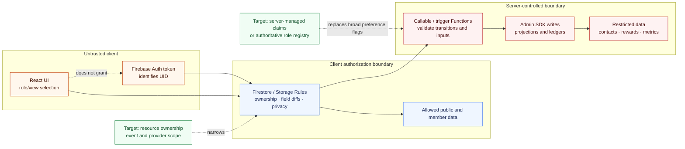

# Authorization boundaries

Identity, UI role state, Rules, and Functions provide different guarantees. Only the backend controls below should grant privileged authority.

Current elevated access is `isGlobalEventCreator()`, which combines a hardcoded super-admin UID with `preferences/{uid}.event_creator`. Provider access is inferred from preference fields. These are migration targets, not proof that the UI role is authoritative.
