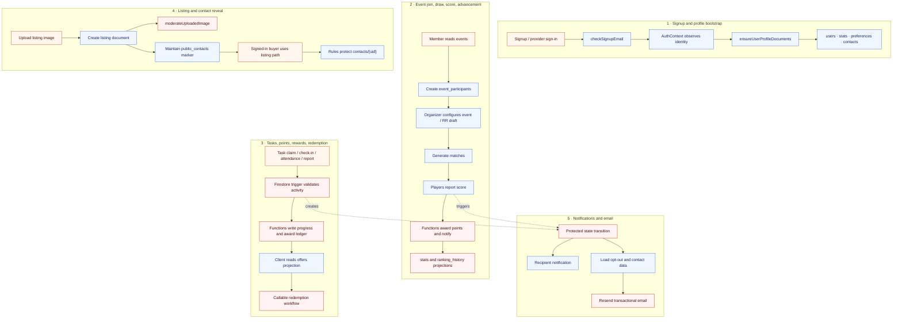

# Core data flow

The main flows below show where the browser reads or initiates work and where Functions maintain protected projections.

The remaining architectural risk is that some tournament score and advancement paths still write stats directly from client code instead of using one server-authoritative scoring path.
