# Firestore data model

The model groups identity, activity, and server-authoritative projections. Document IDs and relationships below are derived from the current client, Functions, and Rules code.

```mermaid
flowchart TB
    subgraph identity["Identity and member profile"]
        users["users/{uid}"]
        stats["stats/{uid}"]
        preferences["preferences/{uid}"]
        contacts["contacts/{uid}"]
        users --- stats
        users --- preferences
        users --- contacts
    end

    subgraph play["Events and play"]
        events["events/{eventId}"]
        participants["event_participants/{id}"]
        drafts["events/{eventId}/rr_drafts/{drawKey}"]
        matches["matches/{id}"]
        history["ranking_history/{uid}/entries/{id}"]
        events --> participants
        events --> drafts
        events --> matches
        matches --> history
    end

    subgraph rewards["Tasks and rewards"]
        tasks["tasks/{id}"]
        claims["task_claims/{id}"]
        offers["offers/{uid}"]
        redemptions["redemptions/{code}"]
        tasks --> claims
        tasks --> offers
        offers --> redemptions
    end

    subgraph access["Access and projections"]
        connections["connections/{pair}"]
        publicContacts["public_contacts/{uid}"]
        notifications["notifications/{id}"]
        listings["listings/{id}"]
        siteStats["site_stats/{id}"]
        adminStats["admin_stats/{id}"]
    end

    users -. shared Firebase Auth UID .-> events
    users -. owns .-> tasks
    participants -. player membership .-> matches
    matches -. accepted opponent pair .-> connections
    listings -. listing-mediated contact .-> publicContacts
    matches -. state transitions .-> notifications
    tasks -. server awards .-> siteStats
    events -. scheduled aggregation .-> adminStats

    classDef identityNode fill:#eff6ff,stroke:#2563eb,color:#172554
    classDef playNode fill:#fff7ed,stroke:#c2410c,color:#431407
    classDef rewardNode fill:#f0fdf4,stroke:#15803d,color:#14532d
    classDef accessNode fill:#faf5ff,stroke:#7e22ce,color:#3b0764
    class users,stats,preferences,contacts identityNode
    class events,participants,drafts,matches,history playNode
    class tasks,claims,offers,redemptions rewardNode
    class connections,publicContacts,notifications,listings,siteStats,adminStats accessNode
```

Server-authoritative or restricted paths include connections, public-contact markers, notifications creation, offers, redemptions, ranking history, aggregate metrics, and reward projections.
