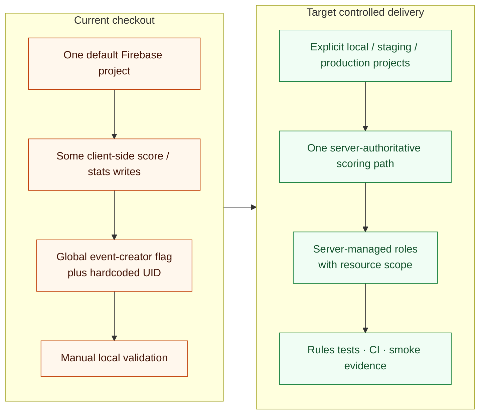

# Modernization before and after

The target preserves the product topology while making environments, authority, and evidence explicit.

This is a delivery and authorization target, not a claim that staging, complete rules coverage, or production deployment readiness already exists.
